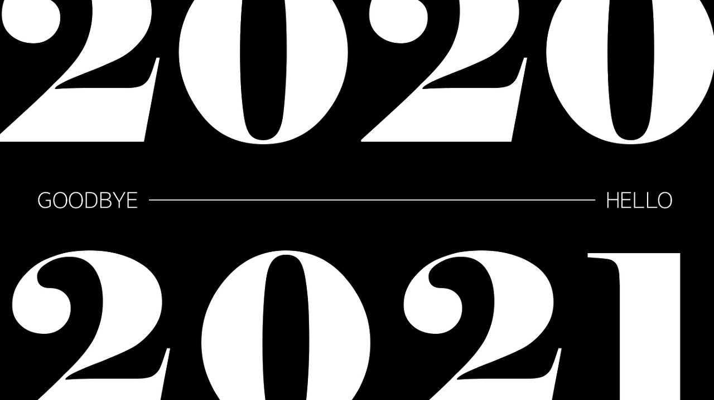
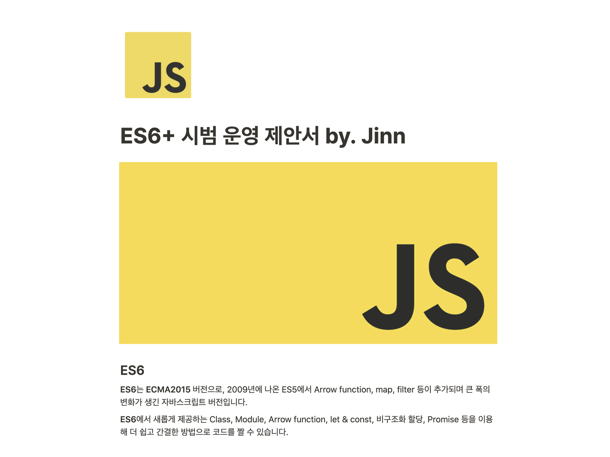
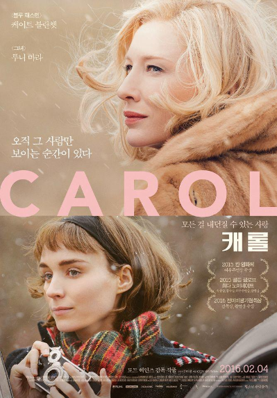
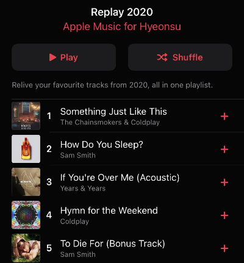
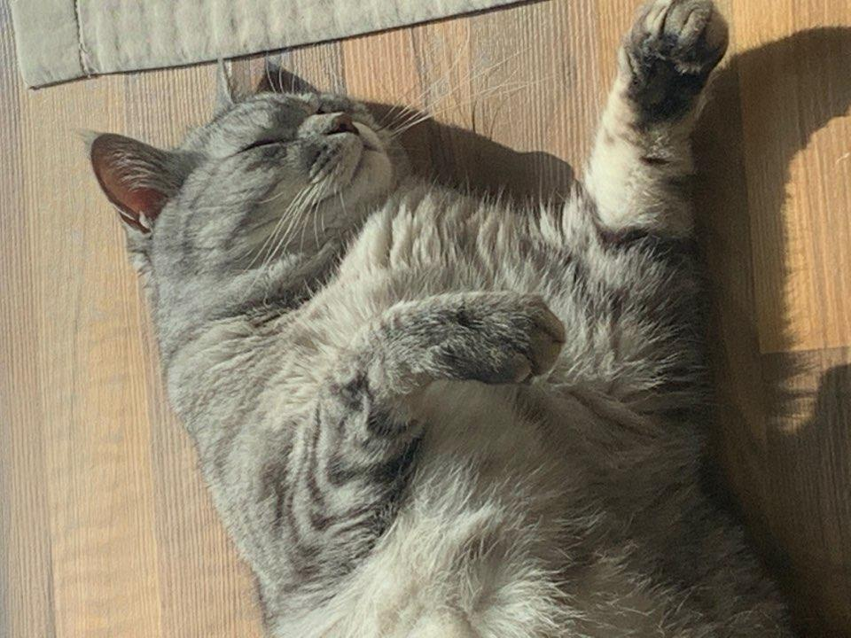

다이어리와 캘린더 앱과 사진 갤러리의 도움을 받아 2020년을 돌아보았습니다. 1월의 기억이 아직 생생하게 남아있는데 벌써 12월의 마지막 주라니... 20대가 되면 시간이 정말 빨리 흘러간다는 어른들의 말이 거짓말이 아니었음을 실감했습니다.......

## 🗞 올해의 빅뉴스

2020년 올해의 기억할만한 큰 사건들이 있었습니다. 한 해가 넘어가며 제가 할 수 있는 것도, 책임을 져야 할 것도 많아진 것 같네요.

## 🎓 졸업!

올해 저는 2020년을 맞아 20살 성인이 되었습니다! 한참 멀 것 같던 으른이 12시 땡 하자마자 되어버리더라고요. 어쩐지 허무한 느낌도 아무것도 바뀌지 않은 느낌도 있었지만 그래도 꿈에 그리던 20대가 되어서 행복했습니다!

코로나가 막 퍼지기 시작한 1월 말이 졸업식이었는데 그래도 다른 학교들보단 이른 편이어서 취소되지 않고 교실에서 진행한 기억이 있네요. 너무! 행복했습니다! 학교 안녕!!! 👋

## 📎 다른 일상

코로나로 개학과 개강이 밀리고 대학 입학식이 취소되는 친구들을 보며 저는 출근을 했습니다. 고등학교 때야 분야는 다르지만 다들 학교에서 공부하고 3학년이 되면 졸업하는 일상이 저와 제 친구들이 다를 바가 없었지만, 졸업을 하고 나니 더 크게 차이가 나기 시작하더라고요. 아무튼, 작년 12월의 끄트머리에 정규직이 되고 **본격적으로 업무에 투입되기 시작했습니다.**

## 🏫 대학

부모님과 고등학교 진학을 약속할 때 대입에 대한 약속도 했었기 때문에 업무에 이리 치이고 저리 치이는 가운데 방송대 2학기 컴퓨터과학과 신입생으로 입학했습니다🥳

한 학기가 얼마 전에 끝났는데 바쁜 와중에 열심히 써서 제출한 시험과 과제들이 좋은 성적을 받아서 뿌듯했습니다. 사실 대부분이 기초적인 이론이고 고등학교에서 배웠던 내용들이 대부분이라 어렵지 않았던 것일 수도 있지만! 그래도...!

앞으로 남은 7학기도 이렇게만 지나가길 간절히 바라고 있어요.

## ✨ 어른이니까

항상 꿈꿔왔던 탈색, 염색도 해보고 오랫동안 고민해왔던 타투도 하고 네일아트도 받아봤습니다! 애플 워치도 월급을 모아 일시불로 질렀죠! (그리고 얼마 되지 않아 새 버전이 나왔지만.......)

좋은 점만 있었던 건 아닙니다. 돈을 벌기 시작하고 성인이 되었으니 제 잘못을 제가 처리해야 하는 책임도 생겼습니다. 맥북에 맥주를 쏟아 수리비만 **70만원**이 나왔죠. 적금을 깨서 고쳤습니다....... 맥북아 오래 행복하자....... 😂😂

책임도 분명 커졌지만 하고 싶었던 것들을 하나씩 해보는 과정이 너무 재미있었습니다! 이거시... 자유.......

# 💻 HYEON the developer

개발자로서 2020년 한 해를 보냈으니 회사와 개발에 대한 얘기를 하지 않을 수는 없겠죠. 1년간 크게 **네 개의 프로젝트**에 참여했습니다! 돌이켜보니 꽤 많은 일을 했더라고요!

## 회사

### 💵 환전 관리자

11월부터 함께 입사한 동기들과 맡았던 첫 실무 프로젝트였습니다. 사용자 서비스가 리뉴얼되면서 관리자 서비스도 리뉴얼하게 되었습니다. Java 기반의 **Spring boot**와 (회사 개발 스펙상 프론트엔드 프레임워크를 사용하지 않아) **HTML, SCSS, JavaScript, jQuery**를 이용해 만들었습니다. 이 서비스를 만드는 과정에서 기획서에 적힌 **기능을 분석**하고 업무를 셋이 **분담**하고 **일정을 짜는 방법**을 배웠습니다.

잘 돌아가고는 있지만 지금 코드를 열어보면 _"도대체 왜...?"_ 소리가 절로 나오고 있는 상태입니다.

### 리팩토링

회사에 **ES6+**를 도입해보고 싶어서 어떤 서비스로 시작을 해야 할까 혼자 고민하던 차 코로나로 인해 사용자가 급감한 환전 관리자 프로젝트가 생각났습니다. 팀장님께 **제안서**를 작성해서 보냈죠.

팀장님의 **긍정적인 피드백**을 받고 ES6+로 버전업 리팩토링을 진행하고 있습니다. 내년 **2월 내에** QA까지 끝내고 배포하는 것을 목표로 하고 있어요. 💪

### ✈️ 해외 여행자

환전 관리자 프로젝트를 개발한 후 기존에 PHP로 운영되고 있는 서비스를 **Java로 마이그레이션** 하는 프로젝트에서 사수와 함께 프론트엔드 수정 작업을 진행했습니다. 공통으로 쓰는 버튼이나 input과 같은 요소들을 분석해 **공통화, 구조화**하여 사용하기 시작했습니다. 또, 앱 내 웹뷰에서 공통으로 사용하고 있기 때문에 앱과 통신하는 **APP Scheme**도 사용해볼 수 있었습니다. 특히 결제창의 window.open 때문에 골머리를 앓았던 기억이 나네요. 절 괴롭게 만들었던 문제에 대한 해결 방법은 [IE window.opener null or undefined 처리하기](https://velog.io/@hellohyeon/IE-window.opener-null-or-undefined-%EC%B2%98%EB%A6%AC%ED%95%98%EA%B8%B0) ⬅️ 여기에 기록되어있습니다.

### 📊 통합 관리자

환전 관리자와 별개로 뿔뿔이 흩어져있던 보험과 관련된 관리자 서비스를 **Java 기반의 서비스로 통합**하기로 했습니다. 현재 운영되고 있는 보험 관련 서비스들과 앞으로 개발될 신규 서비스들을 한 곳에서 **권한에 따라 접근**할 수 있도록 만들었습니다. 이 서비스를 함께 만들게 된 백엔드 동기와 얕은 코드리뷰[(제가 쓴 회고 포스팅)](https://hye-on-astrogrammer.tistory.com/13)[(동기가 쓴 회고 포스팅)](https://t.co/Y72JYQXr5k?amp=1)를 도입하게 되었습니다. 수정사항이 크게 없는 서비스이다 보니 이것저것 ~몰래~ 새로운 기능이나 구조를 실험해볼 수 있었습니다.

### 🐾 펫

**혼자서 프론트엔드 개발**을 맡게 된 신규 서비스였습니다. 이미 세 개의 크고 작은 프로젝트들을 진행했지만 두 개는 거의 회사 내부에서만 보는 **관리자 서비스**였고 사용자용 서비스 하나는 **서포터**로 개발을 했었기 때문에 백엔드 개발자와 함께 **구조를 짜고 로직을 고민하는 과정**이 매우 힘들고 어려웠던 기억이 납니다. 아직 프론트엔드에 대한 이해가 완벽하지 않았던 탓도 있었죠. 사수님이 중간중간 큰 도움을 주셔서 너무 감사했습니다.

우여곡절 끝에 개발과 QA가 끝나고 사용자 배포를 하자마자 **너무 크고 치명적인 이슈**가 발생했습니다. 도움을 주셨던 사수님도 개인적인 이유로 퇴사를 하신 일까지 겹쳐져 그야말로 멘탈이 나갔던 시기였습니다. 다른 백엔드 개발자분들의 도움으로 문제를 해결해 현재는 서비스가 잘 되고 있기는 하지만 혼도 나고 저와 처음부터 함께 개발하시던 개발자분도 퇴사하셔서 뿌듯함과 동시에 복잡한 감정을 느끼는 서비스입니다. 지금은 고양이 옵션을 추가하는 작업을 진행 중입니다. 그래도 백엔드 개발자분, 기획자분, 디자이너분과 고민하며 열심히 만들었으니 **안전하게** 배포됐으면 좋겠어요! 🐱🐶

## 👍 개인

~아마도~ 열심히 혼자서 공부도 했습니다!

### ⚛️ React

미루고 미루던 **리액트 강의**를 들었습니다. 코로나 때문에 수업 내내 마스크를 쓰고 들어야 했고 후반부에는 거리 두기 단계가 강화되며 원격 수업을 진행했습니다. 역시 한 번 만에 리액트를 모두 이해하고 프로젝트를 뚝딱 만들 수는 없더라고요. 그래도 멀게만 느껴졌던 리액트와 그와 관련된 기능들, 라이브러리들에 대해 한 발짝 다가갈 수 있어서 좋았습니다.

### 📄 블로그 개설

미루고 미뤘던 또 다른 일인 **블로그 개설**을 했습니다. velog를 사용하다가 얼마 전 Tistory로 옮겨왔어요. 꾸준히 포스팅하는 것을 목표로 하고 있는데 글 쓰는 걸 무서워하다 보니 자꾸 미루게 되네요....... 게으른 탓도 있습니다.

## 2020년, 개발자로서

사실 프론트엔드는 입사한 후 배우고 시작한 분야입니다. 학교에서는 프로젝트를 할 때마다 백엔드를 주로 맡았고 **“난 프론트 하느니 개발자 안 할래”**라고 말하고 다녔던 사람이었기 때문입니다. 그런데 회사에서 막상 프론트엔드를 접해보니 재미있더라고요!

회사 내에서 한 서비스를 개발할 때 진행되는 전체적인 큰 흐름에 대해 이해할 수 있었고 이런 경우 어떻게 대응할지, 이런 오류에는 어떤 방법을 사용하면 좋을지 이른바 **노하우**도 점차 쌓여가고 있다고 느낍니다. 기능을 만들 때 **확장성**을 고려하게 되었고 중복된 코드가 최대한 들어가지 않도록 적절한 크기로 기능을 묶어 함수화하는 버릇도 들이게 되었습니다.
아, 그리고 **잡오퍼 메일**도 받아봤습니다! 처음엔 잘못 온 건가 싶어서 세 번이나 다시 읽었는데 제 이름이 적혀있더라고요. 여러 가지 사정상 거절할 수밖에 없었지만 올 한 해 개발자로서 가장 기뻤던 순간인 것 같습니다 🥰

**1년 동안 배운 것이 많다면 많고 적다면 적지만 아직 시간과 기회는 충분하기 때문에 꾸준히 발전해나갈 수 있으리라 스스로에게 기대해봅니다 :)**

# ☀️ Bye 2020 Hi 2021

## 2020의 칭찬

-회사에서 프로젝트 **메인 멤버**가 되었다! 엄청난 성장이고 인정이라고 생각한다! -몸도 마음도 **건강**해졌다! 병원에 가야 하는 빈도도 줄었고 약도 줄었다! -뭐라도 해보려고 **노력**은 꾸준히 했다! 시작이 반이지 그럼!

## 2020의 후회

- **리액트 공부**를 제대로 하지 않았다. 프로젝트도 하나 만들려고 했는데 당연히 하지 못했다.
- **기록과 정리**가 습관화되지 않았다.
- 읽다 만 **책**이 너무 많다. 꾸준히 읽어야 하는데.......
- **운전면허**를 기어코 1년 미뤘다.

## 2021년은?

올해의 후회를 바탕으로 **더 나은 내년**을 만들어보고 싶습니다. 내년 회고를 작성하면서 아래 내용들이 부끄럽지 않았으면 좋겠네요.

- **기록하는 습관 기르기**: 작은 것이라도 기록하고 정리하고 공유하는 습관을 만들자.
- **블로그 포스팅 꾸준히 하기**: 잘 쓰지 못해도 괜찮다. 일단 뭐라도 쓰자.
- **책 읽기**: 리팩토링 자바스크립트, 클린 코드 두 권은 반드시 읽고 기록하고 내 코드에 적용해보기.
- **리액트 프로젝트 만들기**: 작은 프로젝트라도 구상, 구현부터 배포까지 반드시 해보기. 이것도 마찬가지로 진행 과정 로깅하기.

# 🎬 올해의 영화

매년 CGV VIP 등급이었는데 올해는 영화관에 못 갔어요. 대신 스트리밍 서비스 구독이 늘었습니다. 넷플릭스, 왓챠, 아마존 프라임, 애플 TV, 티빙, 웨이브를 구독했다가 취소했다가 반복했던 것 같네요. 아무튼 올해의 영화는 **'캐롤'**입니다. 너무 보고 싶었던 영화인데 드디어 올해 크리스마스에 맞춰서 봤어요. 크리스마스나 눈이 오는 날 꼭 생각날 것 같은 영화였습니다. 너무 좋아요💖

# 🎼 올해의 노래

애플 뮤직의 Replay 2020 플레이리스트의 도움으로 올해 가장 많이 들은 노래 Top 5를 소개합니다!

1. The Chainsmokers & Coldplay - Something Just Like This

2. Sam Smith - How Do You Sleep?

3. Years & Years - If You're Over Me (Acoustic)

4. Coldplay - Hymn for the Weekend

5. Sam Smith - To Die For

Coldplay에 푹 빠져서 Coldplay의 곡을 굉장히 많이 자주 들었어요. Top 5 외에도 락을 주로 들었던 한 해인 것 같습니다! ~(락네버다이)~

# 📕 올해의 문구

여름이 가실 무렵 회사 일 때문에 많이 지쳤을 때 이 트윗을 봤습니다. 이 문장을 한참 동안 읽고 또 읽었던 것 같네요. 여전히 큰 힘이 되어주고 있습니다.

<blockquote class="twitter-tweet">
어제는 걷다가 이런 문구를 만났다. 무섭게 써 있었지만 실은 조금 다정했다.  “우리는 모두 중력을 견뎌내는 훌륭한 건축물이다.”  오늘 내 하루의 주문. <a href="https://t.co/5QBrcYubRd">pic.twitter.com/5QBrcYubRd</a>
&mdash; 𓃰Abend𓃰 (@sylvia_jiji) <a href="https://twitter.com/sylvia_jiji/status/1307856857982054401?ref_src=twsrc%5Etfw">September 21, 2020</a></blockquote> 

---

2020년은 여러모로 많은 굴곡이 있었던 한 해였습니다. 저뿐만 아니라 다른 분들도 다들 그렇게 느끼시겠죠. 하지만 2020년 전례 없는 판데믹 시대를 건강히, 무사히 지내온 것만으로도 충분히 잘 보낸 한 해라고 생각합니다. 올해를 이렇게 의미 있게 보낸 모든 분들이 내년에도 건강하고 행복하고 무사한 한 해가 되길 바랍니다. 🥰

