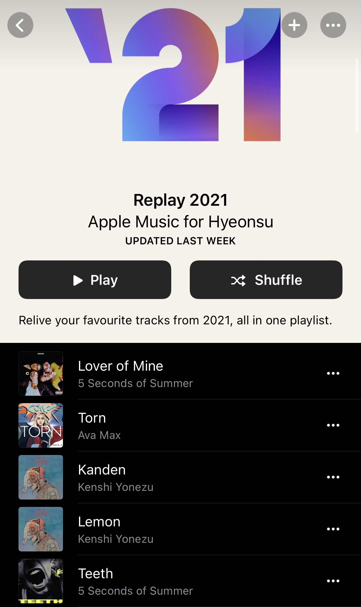

어째서인지 2021년이 끝나고도 16일이나 지나고 말았다. 1월의 중반에서야 2021년 한해, 21살의 나를 돌아보았다. 아래에서 다시 이야기하겠지만 작년 회고에서 다짐했던 2021년의 목표인 '기록하기'를 제대로 하지 않아 이번에도 캘린더 앱과 투두메이트 그리고 슬랙 히스토리의 도움을 받았다. 올해야말로 정말 꼭.......

# 🧑‍💻 이직 (부제: 트위터로 이직하기)

이직을 했다. 생애 첫 회사를 떠나 생애 첫 이직 절차를 거쳐 두 번째 회사에 합류한 지도 2022년 1월 기준 9개월 정도 되었다. 이직하는 과정에 꽤 다이나믹해서 나중에 연사할 때 써먹어야지 했는데 연사를 할 용기도 없고, 코로나 때문에 행사도 잘 열리지 않아서 그냥 회고에다가 쓰기로 결정했다.
첫 회사에서 계속 코드를 복붙하는 작업방식과 HTML5, SCSS, jQuery를 사용하는 기술 스택에 지루함을 느낄때 쯤, 트위터 타임라인을 내리다가 현재 회사의 채용 공고를 보게 되었다. PD라면 그러려니 하고 넘어갔겠지만 이게 무슨 일, 개발자를 뽑는단다. 거기 영상 만드는 곳인데 개발자를 뭐하러 뽑나 궁금해져서 공고 내용을 읽어보긴 했지만 컨텐츠와 서비스의 개념의 차이를 잘 이해하지 못해 팀원 소개에 들어가 그 당시 유일한 개발자인 후니의 트위터 계정을 찾아 DM을 했다.

슬랙 채용 채널에서 발굴해온 캡쳐
감사하게도 후니는 흔쾌히 티타임을 수락해주셨고 대신 티타임시 원활한 이야기를 위해 간략하게라도 이력서와 자기소개서를 보내줄 수 있느냐 물으셨고 나는 노션으로 이력서와 자기소개서를 작성했다.

이력은 회사를 하나밖에 다니지 않았기에 정리까지 오랜 시간이 걸리지 않았고 자기소개서 작성도 평소에도 곧잘 보는 미디어였고 나의 정체성과도 접점이 많은 곳이라고 생각했기 때문인지 큰 어려움을 겪지는 않았다. 다만 이력서를 적을 때 HTML5, SCSS, jQuery를 쓰면서도 이런 스택밖에 없는 나를... 뽑아주나... 싶은 마음이었다. 그래도 한 번 해보고 안되면 어쩔 수 없지 하는 마음으로 이력서와 자기소개를 보냈고 대망의 티타임날, 후니에게 DM이 왔다. 나는 분명 티타임이라고 알고 있었는데 후니에게 오늘 면접에서 뵙겠다는 연락이 온 거였다. 아 큰일 났다. 개발자와 하는 면접인데 기술면접 준비를 하나도 안 한 상태였다. 그야말로 차 마시면서 궁금한 거 물어보고 와야지 하는 안일한 마음으로 오후 반차를 제출해두고 일이 없어 블로그나 쓰고 있었던 것이었다. 어차피 시간도 없고 지금 벼락치기 해봤자 그건 내가 가진 내 능력이 아니기에 그냥 가서 모르면 모른다고 솔직하게 말하자고 다짐했다. 그리고 나는 정말로 가서 React를 써본 적 있냐는 물음에 **아니요. 공부는 해봤지만 실제로 서비스를 만들어본 적은 없어요.** 라고 대답했다. 기술 면접이라고 하기엔 기술에 관한 깊은 질문은 나오지 않는, 그런 애매한 면접도 티타임도 아닌 그런 면접이었다.

쓰다 보니 너무 길어진다....... 압축을 좀 해보자면 놀랍게도(!) React를 사용하는 회사인데 React를 써본 적 없는 나에게 **2차 면접 제안**을 주셨고 흔쾌히 수락했다. 2차는 나와 회사의 핏을 주로 보는 면접이었고. 이 면접에서는 내가 뭘 어떻게 대답했었는지 기억이 잘 안 나지만 1차 때와 마찬가지로 솔직하게 대답했다는 건 확실하다. **여기가 아니면 회사용 자아가 아닌 정말 나 자신이 대답할 수 있는 면접이 없을 거라는 생각에서였다.**

그래서 자기소개서 배경도 이 사진을 썼다.
결과는? **최종 입사 제안! 🎉** 친구들과 연극 공연을 보고 나왔는데 메일이 와 있었다. 공연장 앞에서 나를 포함한 네댓 명이 방방 뛰면서 얼싸안고 기뻐했다. 다들 너무 축하한다며 정말 잘 어울린다고 해줬다. 이 말이 아직까지도 일하면서 듣는 칭찬 중 가장 큰 칭찬이라고 생각한다. **너랑 참 잘 어울린다**는 말. 그렇게 4월 2일, 첫 번째 회사에서의 마지막 퇴근을 끝으로 일주일을 쉬고 4월 12일 혜온으로 합류하게 되었다.

# 💻 열심히 일을 했다

사실 이직이 2021년의 가장 큰 이슈였기 때문에 다른 건 딱히 적을 게 없다....... 이 회고를 작성하고 있는 1월 기준 개발 메인을 맡은 것과 서브를 맡은 것을 포함해 총 9개의 서비스(웹사이트)를 만들었고 그 과정에서 정말 많은 것들을 배웠다. `useEffect`랑 `useState`를 헷갈리던 시절을 지나 그래도 혼자서 작은 프로젝트를 구축할 수 있을 만큼 React를 사용할 수 있게 되었고 Next.js도 익혀나가고 있다. 그럼에도 불구하고 `context`를 사용하고 개발 환경과 배포 환경을 세팅하는 데는 아직도 조금 버벅거린다.

# 👀 이력서를 정리했다

11월, ~이번에도~ 트위터로 DM이 왔다. 고등학생 때 회사 견학을 부탁드렸던 디자이너분께서 다니는 회사에서 주니어 채용을 하는데 내 생각이 났다고 연락을 주셨다. 가벼운 티타임을 요청해주셔서 약속을 잡고 견학을 갔던 회사에서 이직하신 곳에서 정말 오랜만에 뵈었다. 코로나 이전에 뵈었으니 적어도 2년 만이었다. 안부 인사를 나누고 다른 디자이너 한 분과 프론트엔드 개발자 한 분과 함께 회사에 대한 이야기를 짤막하게 나누고는 부담갖지 마시고 이력서를 보내주시면 좋겠다는 말에 일주일동안 이력서를 정리했다. 학교 시험기간과 겹치기도 했고 생각보다 이직 후에 한 일이 많아 첫 번째 이력서보다는 오래 걸렸다. 다른 분들과 개발자 친구들에게 피드백을 받아 수정한 뒤 보내드렸고 결과는 **1차 서류 탈락**이었다. 🥲

워낙 큰 기업이라 붙을 거라는 기대는 없었지만, 막상 떨어지니 조금 슬프긴 하더라....... 그래도 오랜만에 반가운 얼굴을 뵙고 이력서를 정리할 수 있는 귀중한 경험이었다. 또, 오래전에 스쳐 지나갈 수 있는 인연인데 나를 기억해주신 것만으로도 너무 기뻤다. 인연이라는 건 무시할 수 없는 거구나 깨닫기도 했다.

# 🩹 힘든 일은 꼭 동시에 일어난다

개인적인 트라우마 때문에 비 오는 8월을 정말 싫어한다. 그냥 8월도 싫은데 비까지 오면 최악이다. 근데 2021년 8월은 유독 비가 많이 내리는 축축하고 어두운 한 달이었다. 6, 7, 8월 세 달간 몰아친 개발 업무가 소강상태에 접어들자 뒤늦은 피로와 함께 우울감이 몰려왔다. 엎친 데 덮친 격으로 집에 아픈 사람이 한 명 더 생긴 데다가 동생의 수험생활까지 겹쳐 일도 힘들고 집에서 쉬는 것도 쉬는 게 아닌 상태가 되어버렸다. 오죽 힘들었으면 9월이 되자 회사 동료들이 **혜온, 9월이 되니까 그래도 괜찮아 보여요.** 라고 얘기해줄 정도였다. 집에서 많이 울었다. 부모님과 싸우기도 하고 주말마다 아침에 눈을 뜨면 나가서 시간을 죽이고 저녁이 되어서야 집에 들어오기를 몇 번 반복했다. 그래도 지금은 많이 괜찮아졌고 괜찮아지려고 노력하고 있다. 이런 일들까지 배려해준 회사와 회사 동료들에게 감사를 전하고 싶다. 정말 고맙습니다. 올해 8월에는 비가 오지 않기를!

# 🍿 그 외

- 테스페미 플리마켓에서 짧은 연사라고 쓰고 회사 자랑이라고 읽는 발표를 했다.
- 타투를 새로 했다가 망해서 지우는데 100+a만원을 들이고 있다. 타투는 신중히 하자는 뼈가 아픈 교훈을 얻었다.
- 격주에 한 번씩 희곡 읽기 모임을 했다가 지금은 잠시 쉬고 있다.
- 커피를 즐기게 되었다. 회고를 쓰려고 나온 카페의 아메리카노는 맛이 없다.
- 1학기에 평균 4.4점이라는 점수로 전액 장학생이 되었다.
- 그다음 학기에 교양 과목 시험에서 D+이라는 처참한 성적을 받았다. ~초중고대학교를 통틀어 처음 받는 점수다.~ 전공 과목 하나도 B0가 나왔다.
- 회사 MT를 다녀왔다. 정말 재미있었다. 새벽까지 노래를 불렀다. 옛날 노래들을 엄마 덕분에 꽤 알고 있어서 동료들이 인생 2회차냐며 농담도 했다.
- 회사 사무실을 이사했다. 완전 간지나고 멋진 사무실인데 주변에 식당이 별로 없어서 슬프다.

# 💯 작년에 세운 목표 채점하기

[작년 회고](/2020-lookback)를 보면 2021년 목표를 이렇게 적어두었다.

지킨 게 있는지 채점해보았다.

**1. 기록하는 습관 기르기: 작은 것이라도 기록하고 정리하고 공유하는 습관을 만들자.**  
0점. 대신 나는 꾸준함과 부지런함과는 거리가 멀다는 걸 새삼 깨달았다.

**2. 블로그 포스팅 꾸준히 하기: 잘 쓰지 못해도 괜찮다. 일단 뭐라도 쓰자.**  
처참히 0점. 제일 최근 포스트가 2021년 2월 7일이다.

**3. 책 읽기: 리팩토링 자바스크립트, 클린 코드 두 권은 반드시 읽고 기록하고 내 코드에 적용해보기.**  
50점. 클린 코드는 개발팀에서 매주 한 챕터씩 맡아 스터디를 했다. 리팩토링 자바스크립트는 읽다 말았다. 클린 코드 내용이 더 포괄적인데 100점을 주면 안 되는 걸까.

**4. 리액트 프로젝트 만들기: 작은 프로젝트라도 구상, 구현부터 배포까지 반드시 해보기. 이것도 마찬가지로 진행 과정 로깅하기.**  
65점. 이직을 하면서 리액트로 서비스들을 만들었다. 구현부터 배포까지 해보았으나 진행 과정을 로깅하진 않았다.

**총점 400점에 115점이라니 처참하기 그지없다. 그래도 열심히 한해를 잘 살아왔으니 가산점 185점을 추가해 총 300점으로 한 해를 마무리하겠다. 😏**

# 🏆 2021 혜온 어워드

## 🎬 올해의 영화

올해는 영화관에 네 번 정도 갔다. 한 번은 블랙위도우, 두 번은 샹치(양조위)를 보러 갔고 남은 한 번은 건파우더밀크셰이크를 봤다. 세 영화 다 재미있으니 아직 못 보신 분이 계신다면 꼭 한 번 보시길. 그래서 대부분의 영화와 드라마를 왓챠와 넷플릭스에서 봤다. 갑자기 예정에 없던 일본 배우에게 빠져 일본 드라마와 영화들을 엄청 봤는데, 그중 가장 좋았던 건 **넷플릭스 오리지널, <야쿠자와 가족>**  
제목만 보면 으... 하고 거부감이 드는데 정말 좋은 영화였다. 후지이 감독의 연출로 만들어낸 아름다운 영상미와 야쿠자의 일생으로 보는 일본의 짧은 현대사를 보는 느낌이었다. 배우들이 연기를 어마무시하게 한다.

## 🎼 올해의 노래

올해도 (스포티파이를 쓰고 싶은데 너무 비싸서 포기하고 가족 요금제로 묶여있어서 계속 사용하고 있는) 아이튠즈의 도움을 받은 Top 5 리스트. 역시나 밴드 노래가 1위를 차지했고 예상치 못한 3, 4위... J-POP을 듣게 될 줄은 꿈에도 몰랐다.......

## 📕 올해의 문구

연극 <내게 빛나는 모든 것>에 나오는 대사이다. 정말 좋은 공연이었다. 처음 본 날 엄청 추운 크리스마스 다음 날이었는데 너무 울어서 일회용 마스크가 축축하게 젖어 지하철 역까지 걸어가는 길에 얼굴이 얼어붙을 정도였다.

> 만약, 우리가 긴 일생 동안 단 한 번도 절망을 느껴보지 못했다면, 그건 오히려 삶에 충실하지 않았다는 뜻이겠죠.

# 💭 2022년은

새해 목표 삼형제 같은 계획은 이제 그만 세우기로 했다.

세워봤자 안 된다는 걸 22년째에야 깨달았다. 소소하게 지킬 수 있는 것들을 목표로 한 해의 초입에 우르르 세우지 않고 하나하나씩 생기는 대로 리스트에 적어두기로 했다.

- **토이 프로젝트**: 뭐라도 좋다. 하찮아도 좋다.
- **라이브러리 배포하기**: 이것 역시 뭐라도 좋다. 하찮아도 좋다.
- **숨 돌릴 틈을 찾기**: 무작정 계속해서 달려 나갈 수는 없다. 중간에 쉬기도 해야 하고 속도를 늦추기도 해야 한다. 조급해하지 말자.
- **기록하기**: 이건... 새해 목표 삼형제 같은 계획이지만 자꾸 리마인드해야 안 하고 있어도 양심의 가책을 느낄 것 같다.
  싫은 것보다 좋은 것을 더 많이 찾기: 연극 <내게 빛나는 모든 것>을 보고 나도 나에게 빛나는 것들에 대한 리스트를 작성하기 시작했다. 지금까지 약 40개를 적었고 3년 내에 1만 개를 채우는 것이 목표이다. 쓰다 보니 싫어하는 것들보단 좋아하는 것들에 대해 더 많이 생각하게 된다.

# ✨ 마무리지으며

유독 길게 느껴졌던 2021년이 끝났다. 새로운 것들이 많았던 한 해였기에 2022년이 조금 걱정되기도 한다. 새로운 것에 더이상 신나지 않고 도전하고 싶은 마음이 들지 않을까봐. 그럼에도 불구하고 '새것'에 대한 흥미는 꾸준히 가지고 있으니 나 자신을 더 믿어봐도 될 법한 해가 시작된 것 같기도 하다. 2021년 함께했던 회사 동료들과 친구들, 가족과 올해 6살이 된 우리 고양이에게도 큰 사랑과 고마움과 동시에 2022년도 잘 부탁한다는 말을 전하고 싶다. **2022년 #가보자고**
